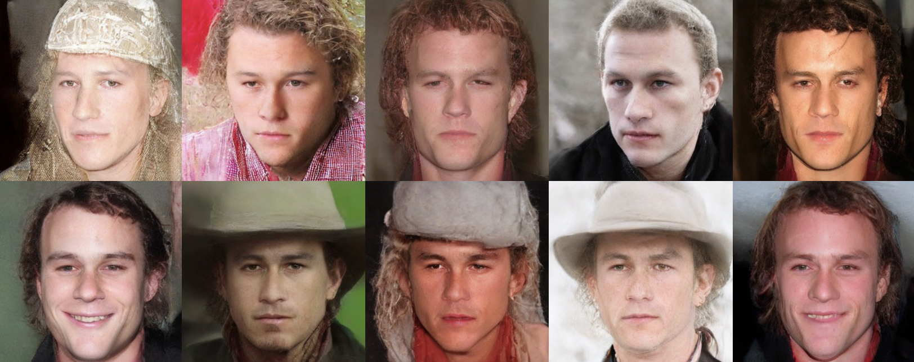
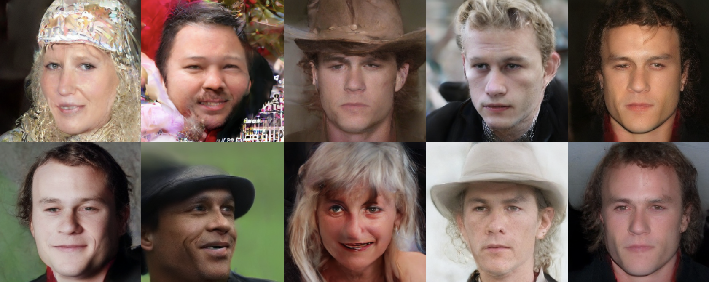

# Unconditional Image Generation-Latent Space

## Firstly, setup the environment
First, ensure that the required code files and the /data folder (containing the training images) are present in the current directory for smooth execution. Code files, instance image folder and a folder named 'data' that contains FFHQ256 dataset should be in the same directory. 

Navigate to this directory where these code files and the dataset folders are located::

```bash
cd <path to the directory containing code files, instance folder and 'data' folder>
```
Then, setup the environment.
```bash
chmod +x setup.sh
./setup.sh
```

## Base model Train
Make sure to specify the path to the training data directory correctly. As default, it is set train_data_dir="data".
```bash
chmod +x base_train.sh
./base_train.sh
```
## Base model Inference
For inference, use the output_dir parameter from the base_train.sh script as the model_id in this step:
```bash
chmod +x base_inference.sh
./base_inference.sh
```

## Dreambooth Train
When training with DreamBooth, ensure you set the output_dir parameter from the base training step as the pretrained_model_name_or_path.

To replicate the results mentioned in the report and train without prior preservation, remove the with_prior_preservation and prior_loss_weight parameters. Also, set max_train_steps to 2400.

```bash
chmod +x dreambooth_train.sh
./dreambooth_train.sh
```

## Dreambooth Inference
For inference with DreamBooth, provide the output_dir parameter from the dreambooth_train.sh script as the model_id here:
```bash
chmod +x dreambooth_inference.sh
./dreambooth_inference.sh
```
## Results
Base model:


Model fine tuned with Heath Ledger Instances without preservation loss:


Model fine tuned with Heath Ledger Instances with preservation loss:


All results were discussed in the [results](https://github.com/a-caycioglu/unconditional-image-generation-latent-space/blob/main/results/results.pdf)
